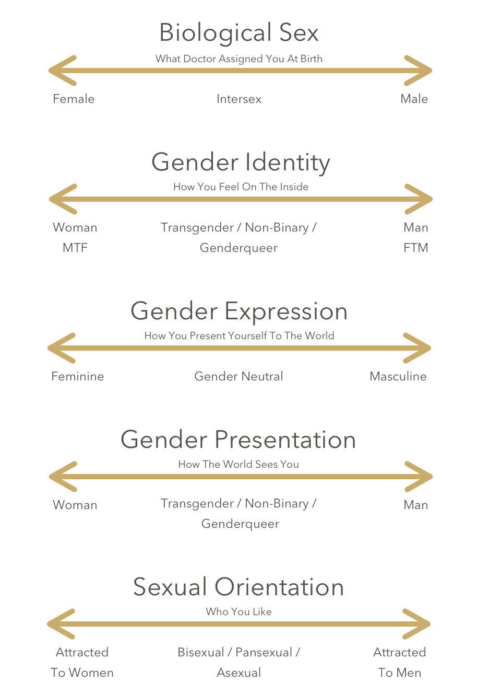

Hello, my name is Jules. My pronouns are they/them. I am non-binary and pansexual.

**Non-binary**: Relating to people whose gender is not completely and exclusively male or female

**Pansexual**: the attraction towards people regardless of their sex or gender identity

_What is the gender binary?_

The gender binary is a Western concept that there are only two gender options: male or female. In this binary model, sex, gender, and sexual orientation are assumed to align by default, based on the sex you were assigned at birth.

_What is non-binary?_

A non-binary person is someone who does not identify as exclusively a man or a woman. In really simple terms, someone who is non-binary might feel like a mix of genders, or like they have no gender at all. Non-binary people may express a combination of masculinity and femininity or neither.

_They/them? Isn't that plural?_

Nope! They/them can refer to a single person as well. You've probably done it before usually when you don't know someone's gender. You might say something like "Is your friend coming to the party? Do I need to know anything about them?". Using they/them to refer to just one person has been around for a long time- even Shakespeare did it. The Merriam-Webster [word of the year](https://time.com/5746516/merriam-webster-word-of-the-year-2019/) in 2019 was they.

_How does this relate to transgender?_

Transgender is an umbrella term for anyone whose internal experience of gender does not match the gender they were assigned at birth. This includes people who identify with the gender binary and those that don't, like non-binary people.

### My story

In the 90's I knew I was attracted to both boys and girls, so I came out as bisexual. In the early 00's I learned that sex and gender were distinct. Shortly after learning that, I experimented with passing as male and considered if I wanted to transition to male. I did not. Being completely masculine didn't fit me in the way that being completely feminine didn't fit me either. I am neither. Or both. It was at that time I started identifying as genderqueer.

Being genderqueer was something that I kept close. I told a few friends over the years, but for the most part it didn't change anything, so I didn't tell people I wasn't deeply connected with. I even jokingly said a few times that my gender is "attack helicopter". When non-binary entered my awareness, I realized that was a better label that genderqueer because it more clearly got at what I feel, and can come with alternative pronouns.

I really struggled with wanting to come out as non-binary, and was acutely aware that it is harder than coming out as queer ever was because it is so much more public. I didn't need to come out as queer to someone unless I was involved with or wanted to share who I am. I didn't need to be out at work, because it really didn't matter. Gender is different. There is so much attached to how the world sees you, including assigning pronouns. We are culturally conditioned to make assumptions about people and what their gender identity is. It just got to a point where it hurt too much to keep who I am hidden. I felt like I was doing a shitty job of trying to hold up a wall that was crumbling down.

I feel my gender everyday, and have felt dissonance and dysphoria since puberty. Being able to step away from a label I didn't choose (female) and pick for myself what I am (non-binary) has been so freeing. Trying to keep myself within only one box was devastating and disorientating. Since this is no longer a secret, I feel such a constricting weight has been lifted from me. I want to be my authentic self and I have been stumbling over this for more than 15 years. Now, I am proud to say I can publicly embrace what has always been true.

There is a part of me that still feels that [My Gender Is: Mind Your Business](https://www.them.us/story/my-gender-is-mind-your-business). For me, the cost of keeping it hidden became too high for me mentally, emotionally, and physically. I recognize I am privileged enough where I am safe to come out. I live in one of the more socially conscious states in the US, Massachusetts. I work for an amazing company that encourages people to put their pronouns in their email signatures. This was an indication to me that I am safe to bring my authentic self to work. Without being able to be out at work, I could not be who I am publicly. It has been a long journey, one which I am so proud and grateful to be on. ❤️🧡💛💚💙💜
