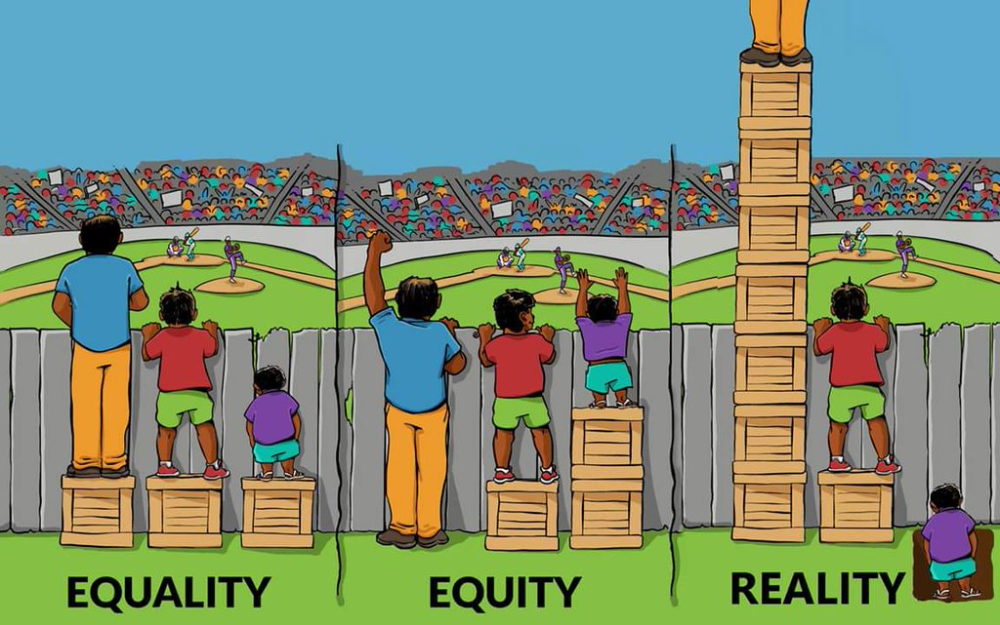

For a long time I thought equality was the goal for social progress. If the system wasn't designed for the rich, if genders were treated the same and if systemic racism could be truly addressed - then perhaps things would be fair (still a massive oversimplification). Fairness is the catch though: fair doesn't mean equal. Equal is everyone gets the same. That's not nearly enough.

<figcaption>Interaction Institute for Social Change | Artist: <a href="http://madewithangus.com">Angus Maguire</a></figcaption>

 

 

Privilege can mean that some people start ahead in life, not to mention the ongoing benefits. Fairness doesn't mean giving everyone the same amount, but giving more to those with less privileges. Those without privileges need more resources and opportunities to catch up after starting behind.

<figcaption><a href="https://twitter.com/urbandata/status/695261718344290304">As seen on twitter</a></figcaption>

 

 

We don't start at the same place in life. Some start way ahead and many start way behind. Where you start and most of the privileges you have no control over and did nothing to earn: they are determined by who you are born to, your body and the circumstances of how you are raised.

You don't choose:

- the country you are raised in
- your race
- your sex assigned at birth by doctors
- the way society stereotypes and treats your perceived gender
- who you love
- if your body works within society's expectations
- the socioeconomic status of your family
- your parents and if they stayed together
- if you were emotionally supported as a child
- your risk for sexual assault
- if you will have the same opportunities based on qualifications

Fair doesn't mean equal. Equality is sameness - it only works if everyone starts from the same place. Equity is fairness: the unequal distribution of resources & the access to the same opportunities for everyone.
