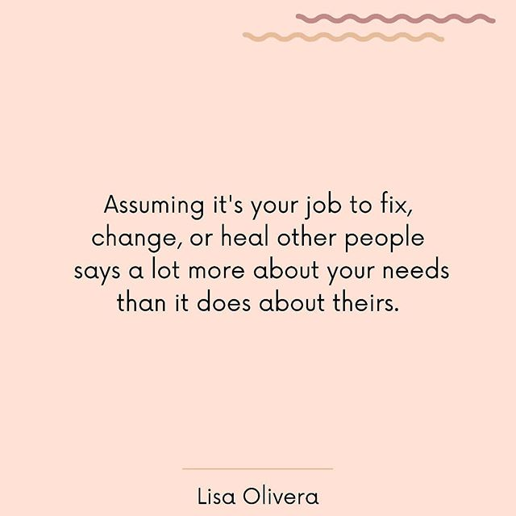
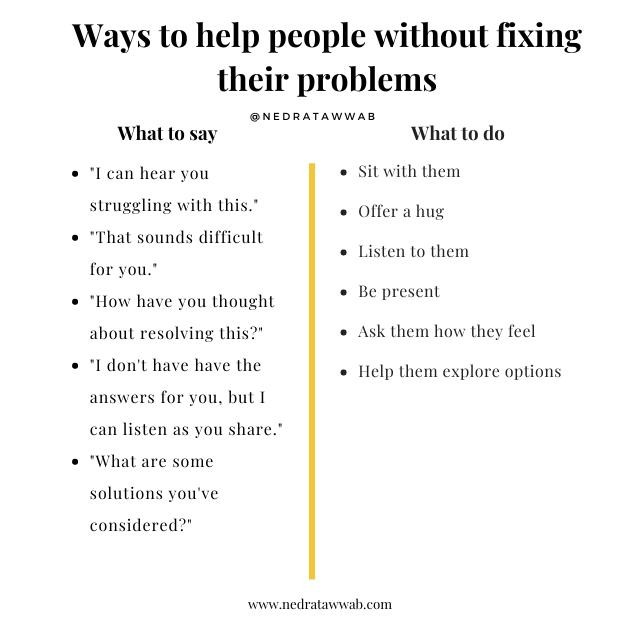

Are you one of the many people who jump to fix other people’s problems? When you hear a concern or a compliant, is your first instinct is to spring to action or suggestions? Do you sometimes mentally jump before the other person is done talking? If this sounds like you, you may want to reconsider this behavior. What seems like an innocent offer to help will often leave others feeling like you’re not really there for them in the way they need, or that you think you are better than them.

## Why we give advice

> Rushing in to offer advice—like rushing in to cheer someone up—may reflect our own inability to remain emotionally present in the face of another person’s problems and pain, or to experience our own.
> If we move in too quickly with solutions, we can make it harder for others to be in touch with their own competence and inner resources, and we unwittingly rob those we love of the opportunity to feel what they are feeling and express it to us. Learning to be a caring listener and a skilled questioner can go a long way toward empowering others to find their own solutions. [Harriet Lerner Ph.D. - Before You Give Advice](https://www.psychologytoday.com/us/blog/the-dance-connection/201902/you-give-advice)

#### Reflection Prompt: Why do you give advice?

If you answered to help people, _go deeper_, and ask yourself if they are asking for help before you give it? If you are giving advice without request, it is unsolicited advice.

So _why_ you are giving unsolicited advice? Some possibilities might be:

- wanting to be in control or right
- emotional validation
- the need for personal power
- it’s easier to change others than change ourselves
- your own emotional discomfort
- lack of your own boundaries

In my own experience, if I am giving advice, there is an underlying false sense that I know what is “right” is or at least what is “better”; that I am in some way superior or have superior insight. In reality, we are all equals and have different paths in life. I have come to learn that the people who explicitly tell me they are _not looking for advice_ are my teachers because they understand their own boundaries.

[Lisa Olivera, a therapist on Instagram: “Thinking we should fix, change, or heal anyone outside of ourselves is a great distraction from doing our own inner work.”](https://www.instagram.com/p/B8hN8r5AMUz/)

## What “Fixing” Communicates

I’ve seen the idea of `#notlookingforadvice` float around. It took time to sink in and after some reflection I realize this is expressing a powerful need. People want to be heard and validated; the behavior of trying to fix takes that away from them. By offering solutions, I am sending them the message that:

1. I am more interested in my feeling good about offering suggestions than listening. "Look how capable and smart I am!" says my ego.
2. I am not validating their experience
3. They are not capable of solving this for themselves

If I am being honest with myself, my giving advice is more about me wanting to feel good than it is about wanting to help someone.

## What to say instead

- Can you tell me more about how you’re feeling?
- That makes sense
- That sounds really **\_\_\_** [tough, hard, frustrating, etc] for you
- I believe you
- I hear you
- Repeat their words back to them to show you heard them
- Ask questions instead of offering suggestions
- What have you tried already?

[Nedra Glover Tawwab, Therapist on Instagram: “Sometimes, the best way to help others is by offering kind words, listening, and being present.”](https://www.instagram.com/p/B7ltEhQgP3s/)

## Moving Forward

So the next time you find yourself in a conversation that you feel the desire to offer advice, ask the other person:

- Do you want me to listen or do you want help finding a solution?
- Are you looking for comfort or for feedback?
- How can I best support you?

Learning how to be present and [Hold Space](/holding-space/) for someone is what to shift towards instead of fixing.

Attempting to fix people limits them from learning how to do things on their own and limits their growth. The challenges of others are not your problems to solve and if you feel the need to take on their problems, that is usually a sign that you need better boundaries. Put your energy into your own inner work, which is the most important work we can do for ourselves. Give yourself some patience and grace as you navigate your own growth.

If this resonates with you, I would love to hear about it. Drop me a [note](mailto:hellothere@juleschevalier.com). Do you have any techniques that have helped you to listen first and offer advice only when asked?

On a personal note: I share this because this is a behavior that I do and am working to improve. This is not a judgment on those who have fixer behaviors. Coping mechanisms are part of your survival toolkit, and it is up to you if that is something you would like to shift in a different direction.
